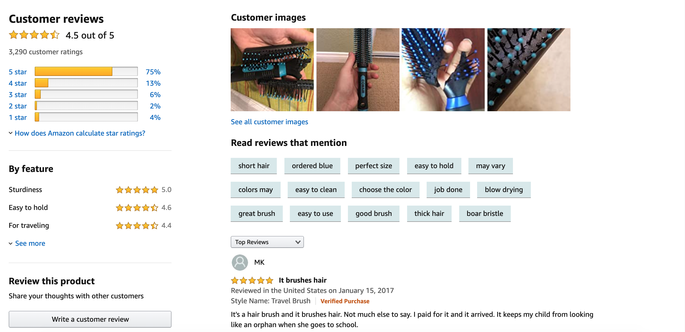
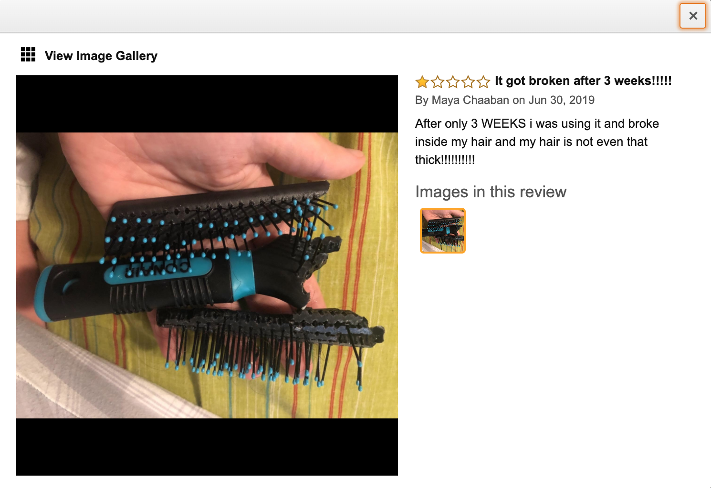
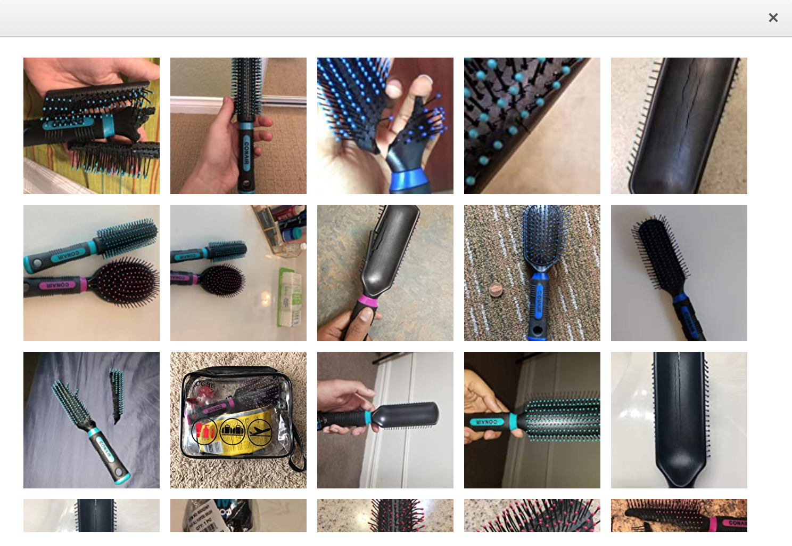

# Customer Images

Built using full-stack knowledge, the Customer Images functionality is one part of a larger Amazon clone. The component is able to render all customer images, as well as all customer reviews and associated data based on a single customer ID.

## Contributors

- [Eric Su - Product Description](https://github.com/GHesericsu/product-images-viewer)
- [Sumit Lal - Carousel](https://github.com/sumitSLal/video-carousel)
- [Albert Wu - Customer Images](https://github.com/AlbertWu2020/customer-images)
- [Jake Turchetta - Customer Reviews](https://github.com/jaketurchetta/customer-reviews)

## Tech Stack

All functionality in this project was built primarily with ReactJS on the front end, Node/Express on the back end, and MongoDB/MySQL for the database.


## User Stories

- As a User, I should be able to view images in customer review content.
  
- As a User, I should be able to refine customer review by selecting a relavant image.
  
- As a User, I should be able to browse all customer images, and have it connected to the main review content view.

  

## Table of Contentes

1. Usage
2. Requirements
3. Development

## Usage

1. Install npm package in root directory:

```
npm install
```

2. Create container by running the app in the background:

```
docker-compose up -d
```

3. Navigating to localhost:3003

```
http://localhost:3003
```

4. Disconnect server and clean up

```
docker-compose down --rm all
```

## Requirements

An `nvmrc` file is included if using nvm.

- Node 6.13.0
- nodemon
- MongoDB

## Development

### Installing Dependencies

From within the root directory:

```#!/bin/bash
npm install -g webpack
npm install axios
npm install body-parser
npm install express
npm install mongoose
npm install react
npm install react-dom
```
